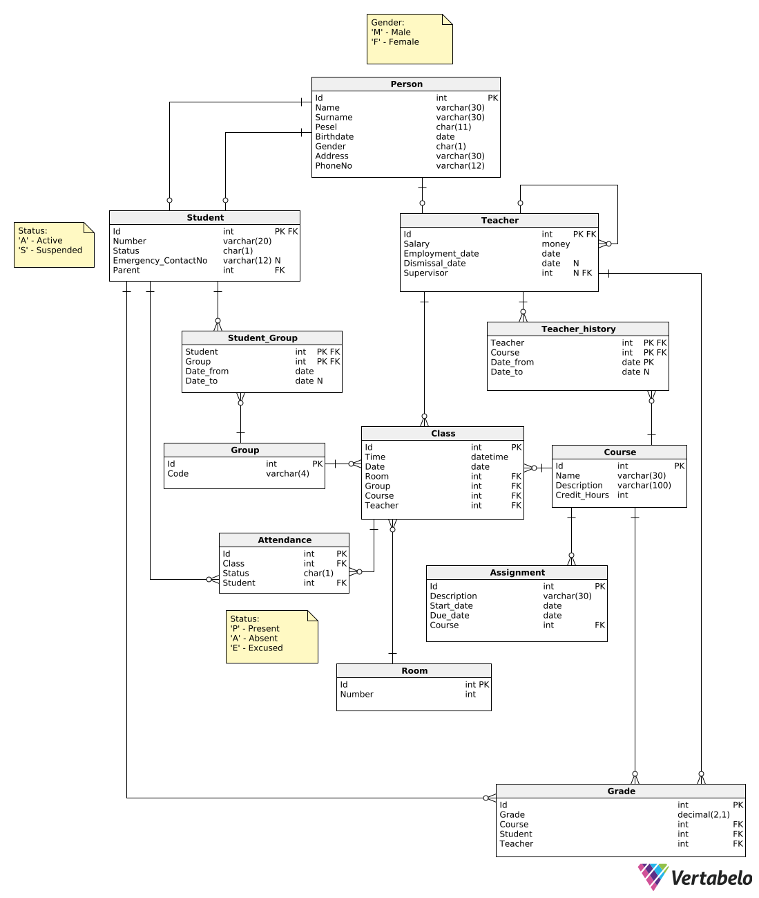

# Overview
The **School Management Database System** is designed to efficiently store and manage school-related data, including students, teachers, courses, and grades. It provides a structured database with stored procedures and triggers to automate operations such as enrollment, grade assignment, and student ranking.

## Table of Contents
- [Functionalities](#functionalities)
- [Technologies Used](#technologies-used) 
- [ERD Diagram](#erd-diagram)
- [Installation Instructions](#installation-instructions)
- [Stored Procedures and Triggers](#stored-procedures-and-triggers)
- [How To Test Stored Procedures and Triggers](#how-to-test-stored-procedures-and-triggers)


## Functionalities
- **Student Management**: Registering students, tracking attendance, and managing grades.
- **Teacher Management**: Assigning courses, updating records, and storing evaluations.
- **Course & Enrollment Management**: Handling course schedules, enrollments, and prerequisites.
- **Automated Triggers & Procedures**: Enforcing business rules, validating data integrity, and 
automating updates.

## Technologies Used
You can choose one of the following database implementations:
- **Microsoft SQL Server (MSSQL) with T-SQL** – MSSQL as database choice, and **T-SQL** for writing queries, procedures, and triggers.
- **Oracle Database with PL/SQL** – Oracle as database choice, you will use **PL/SQL** for writing queries, procedures, and triggers.
- **Vertabelo** – Used for designing the ERD diagram.

## ERD Diagram


## Installation Instructions
### 1. Clone the Repository
```sh
git clone https://github.com/shehabkh03/SchoolManagementDatabaseSystem.git
cd SchoolManagementDatabaseSystem
```
### 2. Choose Your Database System
This project supports Microsoft SQL Server (MSSQL) or Oracle Database, but you only need to set up one of them. Follow the appropriate setup instructions based on your chosen database system.

#### Option 1: Setup in Microsoft SQL Server
1. Open your database management tool of choice (e.g., SQL Server Management Studio, Azure Data Studio, or DataGrip) and connect to your MSSQL Server using your database credentials.
2. Run the following scripts within the existing database in the correct order:
```sh
SQL_Scripts/T-SQL/ddl.sql
SQL_Scripts/T-SQL/dml.sql
SQL_Scripts/T-SQL/Procedures_TriggersWithtestcases.sql
```

#### Option 2: Setup in Oracle Database
1. Open your database management tool of choice (e.g., SQL Server Management Studio, Azure Data Studio, or DataGrip) and connect to your MSSQL Server using your database credentials.
2. Run the following scripts within the existing database in the correct order:
```sh
SQL_Scripts/PL-SQL/ddl.sql
SQL_Scripts/PL-SQL/dml.sql
SQL_Scripts/PL-SQL/Procedures_TriggersWithtestcases.sql
```
### 3. Final Step
After running the scripts, your database should be properly configured. You can now test the stored procedures and triggers as described in the next section.

## Stored Procedures and Triggers  

### 1. Stored Procedures  
Stored procedures are used for handling automated operations within the database.  

- **CalculateAvgGradeAndRank**: Computes a student’s average grade and determines their rank.  
- **Enrollment Procedures**: Automates student enrollment and ensures prerequisites are met.  
- **Grade Management**: Updates student grades and maintains historical records.  

### 2. Triggers  
Triggers enforce **data integrity** and automate changes when specific events occur.  

- **Validate Enrollment**: Prevents students from enrolling in conflicting courses.  
- **Auto-Recalculate Grades**: Updates average grades when new scores are added.  
- **Prevent Invalid Entries**: Ensures only valid data can be inserted into critical tables.  

---

## How to Test Stored Procedures and Triggers  

**Test cases for all stored procedures and triggers are already included** each procedure/trigger in the following file:  

📄 **`Procedures_TriggersWithtestcases.sql`**  

To test them, simply select the the query you want to test and run it.  

```sql
SQL_Scripts/T-SQL/Procedures_TriggersWithtestcases.sql  -- For MSSQL  
SQL_Scripts/PL-SQL/Procedures_TriggersWithtestcases.sql  -- For Oracle  
